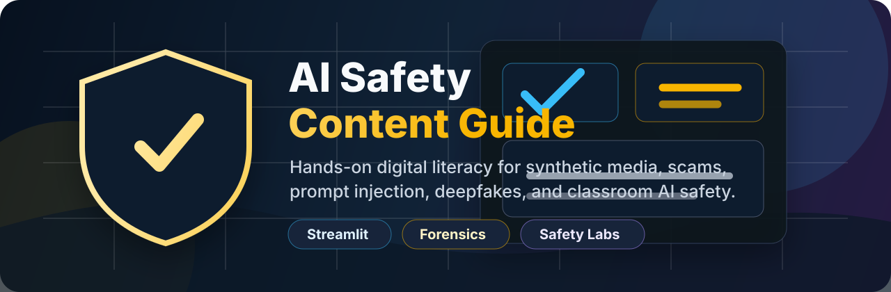

# AI Safety Content Guide



An interactive Streamlit learning platform that helps parents, educators, and students understand the risks of AI-generated content. The app combines AI literacy lessons, forensic deepfake examples, prompt-injection simulations, scam-response scenarios, and practical reporting guidance into one guided experience.

## Why This Project Stands Out

Generative AI has made synthetic text, images, audio, and video easier to create and harder to verify. This project turns that problem into a hands-on educational experience: users do not just read about misinformation, they practice identifying it, responding to it, and building safer digital habits.

## Core Features

- **AI safety learning path** covering misinformation, algorithmic bias, prompt injection, AI hallucinations, and child-facing content risks.
- **Forensic challenge module** with local AI-generated image cases that train users to spot artifacts such as warped geometry, inconsistent lighting, extra limbs, and blended objects.
- **AI text X-Ray analyzer** that demonstrates rule-based synthetic-writing signals and teaches users why detector results should be treated carefully.
- **Prompt injection simulator** where users experiment with jailbreak-style prompts in a controlled training environment.
- **Interactive crisis simulator** for AI voice-clone scams, deepfake investment fraud, and authority phishing attempts.
- **Content moderator sandbox** that scores user decisions on realistic social-media misinformation examples.
- **Knowledge quiz engine** with randomized rounds, explanations, and cumulative scoring.
- **Community sharing board** for parents and educators to share experiences and mitigation tips.
- **Research hub** linking AI safety, ethics, education, and digital citizenship resources.

## Tech Stack

| Area | Tools |
| --- | --- |
| App framework | Streamlit |
| Language | Python |
| Data handling | Pandas, JSON, CSV |
| Content | Markdown, local datasets |
| Styling | Custom CSS theme |
| Assets | Local forensic image set |

## Project Structure

```text
.
|-- ai_safety_app.py                 # Main Streamlit application and navigation
|-- src/
|   |-- content_manager.py           # Markdown, quiz, and research data loaders
|   `-- quiz_engine.py               # Randomized quiz flow and scoring
|-- data/
|   |-- content/                     # Educational markdown content
|   |-- interactive/                 # Quiz data and shared experience CSV
|   `-- research/                    # Curated AI safety source list
|-- images/                          # Local forensic challenge visuals
|-- styles/style.css                 # Custom Streamlit visual theme
`-- requirements.txt
```

## Getting Started

### 1. Clone the repository

```bash
git clone https://github.com/sidhesh0706/safetycontent.git
cd safetycontent
```

### 2. Create and activate a virtual environment

```bash
python -m venv .venv
.venv\Scripts\activate
```

### 3. Install dependencies

```bash
pip install -r requirements.txt
```

### 4. Run the app

```bash
streamlit run ai_safety_app.py
```

Then open the local URL shown by Streamlit, usually `http://localhost:8501`.

## Learning Modules

| Module | What users practice |
| --- | --- |
| Project Introduction | Understanding why AI safety matters for families and classrooms |
| Risks and Misinformation | Evaluating deepfakes, bias, synthetic media, and safety bypasses |
| Forensic Challenge | Inspecting generated images for visual artifacts |
| AI Text X-Ray Analyzer | Recognizing common synthetic-writing patterns |
| Content Moderator Sandbox | Classifying posts as real, fake, or risky |
| Prompt Injection Simulator | Understanding how adversarial prompts bypass guardrails |
| Crisis Simulator | Responding safely to voice-clone, phishing, and deepfake scams |
| Digital Literacy Guide | Building verification habits and family/classroom AI rules |
| Quiz | Reinforcing concepts through scored practice |
| Research and Resources | Exploring credible external AI safety references |

## Design Goals

- Make AI safety practical for non-technical audiences.
- Convert passive awareness into active verification habits.
- Give educators ready-to-use modules for classroom discussion.
- Help families create safer norms around AI tools, social media, and synthetic content.
- Present a polished, portfolio-ready Streamlit application with local assets and custom styling.

## Deployment Notes

This project is ready for deployment on Streamlit Community Cloud:

1. Push the repository to GitHub.
2. Create a new Streamlit app from the repository.
3. Set the entry point to `ai_safety_app.py`.
4. Deploy with the dependencies from `requirements.txt`.

No API keys are required for the current version.

## Future Improvements

- Add authenticated moderation for community posts.
- Store shared experiences in a database instead of a CSV file.
- Add more age-specific learning paths.
- Include classroom worksheets or exportable facilitator notes.
- Add automated tests for data loading and quiz behavior.

## Author

Built by [Sidhesh](https://github.com/sidhesh0706) as an AI safety education and digital literacy project.
